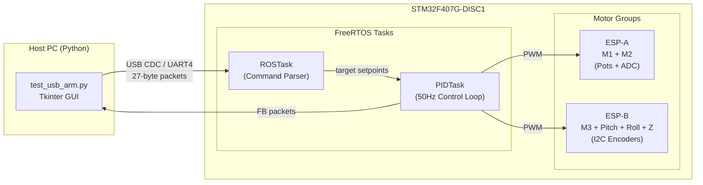

# STM32 Robot Arm Firmware — Code Documentation

## Architecture Overview



The firmware runs on FreeRTOS with two main tasks:

| Task | Function | Rate | Priority |
|---|---|---|---|
| `RobotCore_ROSTask` | Parses incoming commands, manages comms watchdog | ~20Hz | Normal |
| `RobotCore_PIDTask` | Reads sensors, runs PID, drives motors, sends feedback | 50Hz | High |

---

## File Descriptions

### [RobotConfig.h](file:///c:/Users/pagaw/OneDrive/Desktop/stm/armmm/Core/Inc/RobotConfig.h)
All tuneable constants in one place. Contains:
- **Pot lookup tables** — ADC-to-angle mapping for M1 (28 points) and M2 (18 points)
- **Encoder config** — HOME_OFFSETS, direction signs, gear ratios, MUX channel assignments
- **Physical limits** — POS_MIN/MAX, PITCH_LIMIT_MIN/MAX, raw endpoint limits
- **PID gains** — Kp/Ki/Kd for all 4 encoder joints, plus output/integral caps
- **Safety params** — Deadzone, slew rate, sensor fail threshold, comms timeout

### [RobotCore.h](file:///c:/Users/pagaw/OneDrive/Desktop/stm/armmm/Core/Inc/RobotCore.h)
Class and struct definitions:
- **CommandPacketUnified** — 27-byte packed struct (`header[2] + motor_cmd[6] + footer`)
- **FeedbackPacketUnified** — Same layout, echoed back with sensor readings
- **SimpleKalmanFilter** — 1D filter used to smooth ADC readings for pot motors
- **PotMotor** — Full motor controller class (trajectory, PID, stall detection, Kalman)
- **C bridges** — `RobotCore_Init`, `RobotCore_ROSTask`, `RobotCore_PIDTask`

### [RobotCore.cpp](file:///c:/Users/pagaw/OneDrive/Desktop/stm/armmm/Core/Src/RobotCore.cpp)
Main firmware logic (726 lines). Described in detail below.

---

## Communication Protocol

### Packet Format (27 bytes, little-endian)
```
| header[2] | motor_cmd[0..5] (6 × int32) | footer '\n' |
```

All values are **degrees × 1000** (millidegrees) for position commands.

### Command Types

| Header | Name | Purpose |
|--------|------|---------|
| `ST` | **Set Target** | Normal operation — sets position targets for all 6 joints |
| `DT` | **Debug/Passive** | Keeps comms alive but does NOT change any motor setpoints |
| `PT` | **PWM Direct** | Open-loop mode — sends raw PWM (-255 to +255) to each motor |
| `KT` | **PID Tune** | Live update of Kp/Ki/Kd for a specific joint |

### Feedback (`FB`)
After every PID cycle, the STM32 sends back a 27-byte `FB` packet:
- **Normal mode (ST)** — Joint positions in millidegrees
- **Debug mode (DT/PT)** — Raw ADC values (M1/M2) and raw encoder readings (M3/Pitch/Roll/Z)

---

## Motor Control Architecture

### ESP-A: Potentiometer Motors (M1, M2)

These are wrist/shoulder joints using **analog potentiometers** read via ADC.

**Data path:**
```
GUI slider (degrees) → ST packet → pot_targets[] → PotMotor::updateTrajectory()
    → commandedAngle (slew-rate limited) → PID → DriveMotor()
```

**Key features:**
- **ADC-to-Angle lookup** — Piecewise linear interpolation from hand-measured calibration tables
- **Kalman filter** — Smooths noisy ADC readings before angle conversion
- **Trajectory slew** — Limits commanded angle change to 2°/cycle to prevent jerky motion
- **Stall detection** — If the motor hasn't moved >0.1° in 20 consecutive 100ms checks (2 seconds), it's marked stalled and disabled. Prevents motor burnout.
- **Minimum power mapping** — PWM is remapped from `[0, 255]` to `[120, 255]` to overcome static friction

### ESP-B: I2C Encoder Motors (M3, Pitch, Roll, Z-Axis)

These joints use **AS5600 magnetic encoders** read over I2C through a **TCA9548A multiplexer**.

**Data path:**
```
GUI slider (degrees) → ST packet → degToSteps() → target_pos[]
    → trajectory slew → commanded_pos[] → PID → mixer/DriveMotor()
```

**Each joint has different handling:**

#### M3 (Link 3) — Multi-turn with Gear Ratio
- Uses **continuous position tracking** with wrap detection (crosses 4096→0)
- 2:1 gear ratio — motor turns 2× for every 1× of output shaft
- Soft limits at ±4096 motor steps (±180° output)
- PID uses continuous position, not wrapped single-turn values

#### Pitch — Linear with Dead-Zone HOME
- `HOME_OFFSETS[1] = 19` placed in the encoder's physical dead zone
- All corrected values are continuous (32 → 4065), **no wrapping**
- Uses `PITCH_HOME_STEPS = 3281` as the 0° reference
- Linear PID (direct subtraction, no `wrapError`)
- Hard clamped to `[PITCH_LIMIT_MIN, PITCH_LIMIT_MAX]`
- **Raw endpoint safety** — Motor killed if raw reading hits 51 or 4084

#### Roll — Circular Single-turn
- Uses `wrapError()` for circular 0-4096 range (shortest-path seeking)
- No gear ratio — encoder directly on joint shaft

#### Z-Axis — Multi-turn with Gear Ratio
- Same continuous tracking as M3 but with 2.7272:1 gear ratio
- Output limited to ±120°
- PID output capped at 127 (instead of 255) for safety

### Wrist Differential Mixer

Pitch and Roll share two physical motors (Motor A and Motor B) in a differential configuration:
```cpp
motorA = pitch_cmd + roll_cmd
motorB = -pitch_cmd + roll_cmd
```
Both motors turning the same direction → Roll. Opposite directions → Pitch.

The mixer normalizes output so neither motor exceeds 255 PWM.

---

## Control Flow Detail

### 1. Initialization (`RobotCore_Init`)
1. Start all 6 PWM timer channels
2. Read initial ADC values for M1/M2 pots
3. Initialize pot motors with current physical position (prevents launch jolt)
4. Copy default PID constants into mutable runtime arrays
5. Start UART DMA for continuous background reception
6. Prepare feedback packet header/footer

### 2. Command Parsing (`RobotCore_ROSTask`)
1. Check both UART DMA buffer and USB CDC ring buffer for valid packets
2. On **first valid packet** (comms_ok transition):
   - Re-read all sensors
   - Initialize all targets/commanded positions to current physical state
   - Enable all motors
   - This prevents any position jump on connection
3. Decode packet type (ST/DT/PT/KT) and update targets accordingly
4. **Comms watchdog** — If no valid packet in 1000ms → `emergencyStopAll()`

### 3. PID Control Loop (`RobotCore_PIDTask`)
Runs every 20ms (50Hz). Steps:

1. **Read ADCs** — Poll ADC for M1/M2 potentiometers
2. **Read Encoders** — I2C through MUX for M3/Pitch/Roll/Z
3. **Update Pot Motors** — Call `PotMotor::update()` for M1/M2
4. **Update ESP-B Trajectories** — Slew-rate limit commanded positions toward targets
5. **Compute PID** — Error → P + I + D for each encoder joint
6. **Apply Motor Outputs** — Either open-loop PWM or PID-controlled
7. **Transmit Feedback** — Send FB packet over both UART and USB CDC

### 4. Emergency Stop (`emergencyStopAll`)
- Sets all PWM to 0
- Disables all motor controllers
- Clears comms_ok flag
- Zeros all integral terms
- Triggered by comms watchdog timeout

---

## Encoder Coordinate System

```
Raw AS5600 (0-4095) → Corrected = raw - HOME_OFFSETS (mod 4096) → Steps
```

| Joint | HOME_OFFSETS | Corrected Range | Coordinate Type |
|-------|-------------|-----------------|-----------------|
| M3 | 3306 | 0-4095 (circular) | Multi-turn continuous |
| **Pitch** | **19 (dead zone)** | **32-4065 (linear)** | **Linear, no wrapping** |
| Roll | 823 | 0-4095 (circular) | Single-turn wrapped |
| Z-Axis | 3813 | 0-4095 (circular) | Multi-turn continuous |

### Why Pitch Uses Dead-Zone HOME
The pitch encoder has nearly 360° of physical travel (354.5°) with a tiny 63-step dead zone. By placing `HOME_OFFSETS` at position 19 (center of dead zone), the corrected encoder values are always continuous — no wrapping through 0/4096. This eliminates a class of bugs where linear clamping and PID error calculation broke due to wrap discontinuities.

---

## Suggested Improvements

### 🔴 Critical

1. **M2 ADC reads as 0** — In the `read_encoders.py` output, M2 ADC is consistently 0. This suggests the ADC channel for M2 is either disconnected or the polling sequence is wrong. The code assumes sequential `HAL_ADC_PollForConversion` calls return M1 then M2, but this depends on the ADC channel scan order configured in CubeMX.

2. **USB CDC PermissionError(13)** — The `WriteFile failed` error occurs regularly and kills the connection. This is likely caused by the STM32's CDC driver resetting when the host sends data too fast. Improvements:
   - Add a small delay (1-2ms) between USB writes
   - Implement USB reconnection logic in the Python script
   - Use a powered USB hub to isolate the connection

3. **`ENCODER_DIRECTION` array is unused** — Despite being declared in `RobotConfig.h`, only `readEncoder()` references it. Since all values are now `{1,1,1,1}`, the entire ENCODER_DIRECTION mechanism and the `if (ENCODER_DIRECTION[joint] == -1)` branch in `readEncoder()` are dead code. Either remove it or document why it's kept for future joints.

### 🟡 Medium Priority

4. **PotMotor integral term calculation is unusual** — The line `integral = integral + (error * ki) * dt` premultiplies by `ki`, then later uses `P + integral + D` without `ki`. Standard PID would accumulate `integral += error * dt` and then compute `ki * integral`. The current form works but makes Ki non-intuitive (it's effectively `ki²`).

5. **Feedback timestamp** — The FB packet has no sequence number or timestamp. Adding one would help diagnose communication lag and dropped packets.

6. **PID derivative term sign** — The pot motor PID uses `D = -kd * (dAngle/dt)` (derivative of measurement), while the encoder PID uses `d_term = kd * (dPos/dt)` then subtracts it. Both are correct ("derivative on measurement"), but the inconsistent style makes the code harder to read.

7. **M3/Z wrap detection is fragile** — The multi-turn tracking checks `if (delta > 2048)` to detect wraps. This works at 50Hz for slow motion, but a rapid >180° movement within one cycle (unlikely but possible with gearing) would be misdetected as a wrap in the wrong direction. A velocity-based predictor would be more robust.

### 🟢 Nice to Have

8. **Magic numbers** — `15` (motor cutoff PWM), `120` (minimum power), `100` (integral limit), `2.0f` (trajectory slew deg), `0.1f` (stall threshold) are all hardcoded in `RobotCore.cpp`. Moving them to `RobotConfig.h` would consolidate all tuning.

9. **No anti-windup on pot integral** — The integral term is clamped at ±100, but there's no back-calculation or conditional integration. When the motor is saturated (PWM = 255), the integral continues to accumulate, causing overshoot on direction change.

10. **ADC polling in PID task** — `HAL_ADC_PollForConversion` blocks the high-priority PID task for up to 10ms per conversion (20ms total for 2 channels). Using DMA-based ADC with a timer trigger would eliminate this blocking and ensure consistent 50Hz timing.

11. **Stall detection only for pots** — The encoder joints have no stall detection. If an encoder joint hits a mechanical stop, the PID will continue to drive at full power indefinitely (until integral saturation). Adding stall detection for encoder joints would protect the motors.

12. **`JOINT_ALLOWED` array exists but is never checked** — `RobotConfig.h` declares `JOINT_ALLOWED[4]` but no code references it. It was presumably intended to disable specific joints without recompiling.
